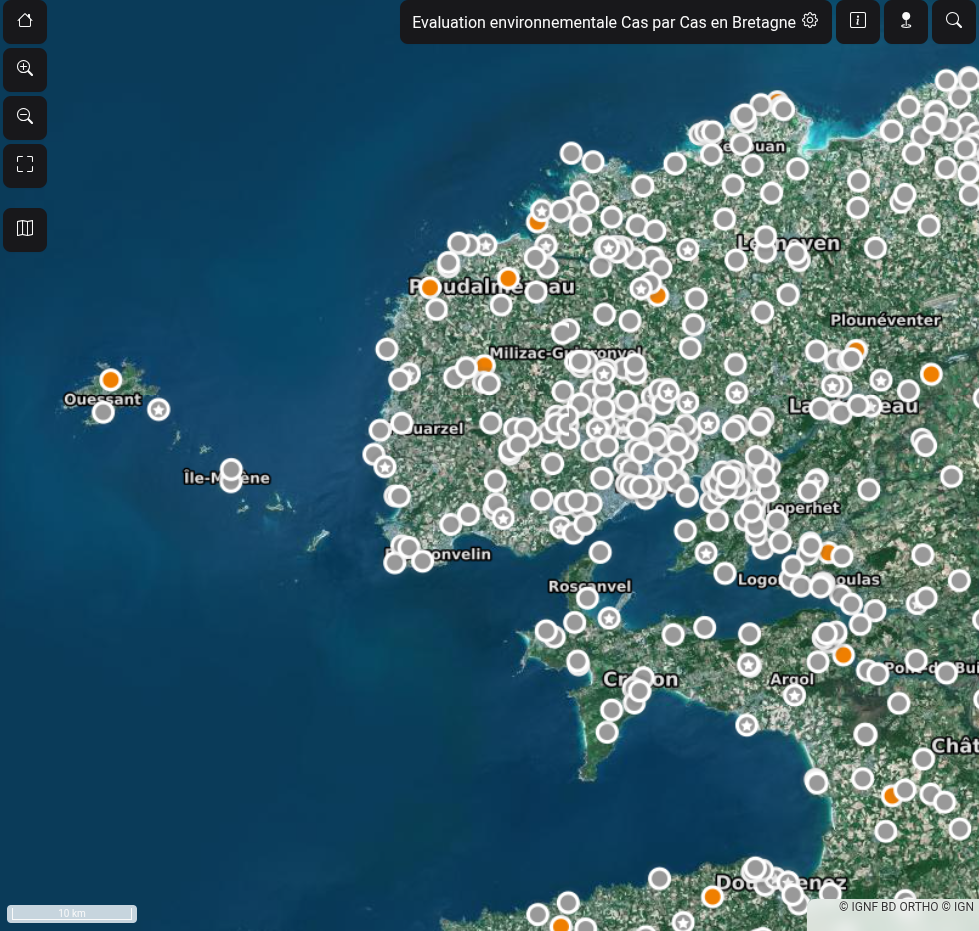
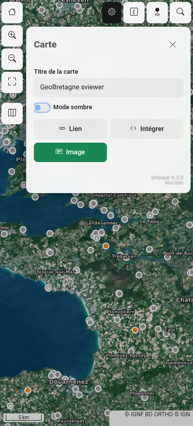
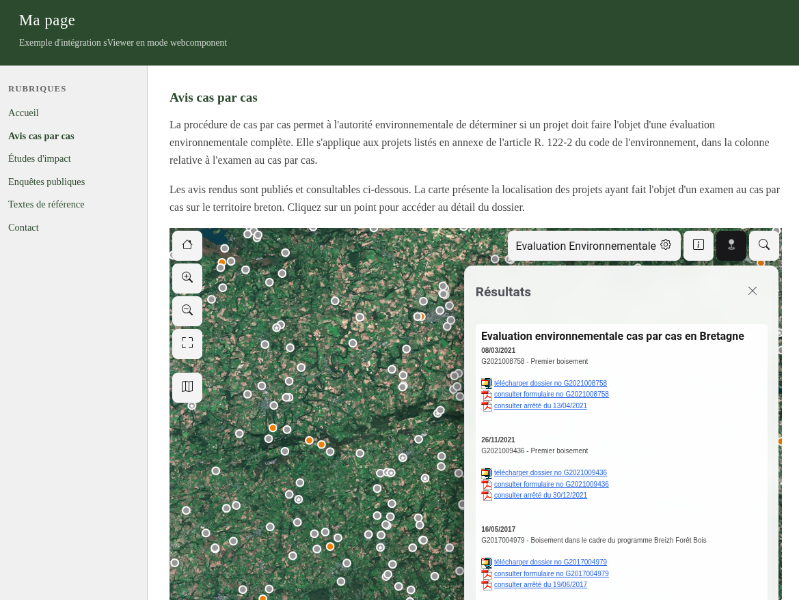

sViewer — Visualiseur de cartes web
=====================================

sViewer affiche des cartes interactives dans un navigateur, sur téléphone, tablette ou ordinateur. Aucune installation, aucun compte requis.

---




Que permet sViewer ?
---------------------

* **Partager une vue exacte** — zoom, position et données préservés dans l'URL
* **Générer un QR code** — imprimez-le sur un panneau, une affiche, un document
* **Exporter en image** — PNG depuis le panneau de partage
* **Interroger les données** — cliquez sur la carte pour afficher la fiche d'une zone ou d'un objet
* **Traçabilité des données** — producteur, licence, date de mise à jour affichés automatiquement depuis les métadonnées
* **Superposer des données GeoJSON** — chargez n'importe quel fichier GeoJSON distant (GitHub, data.gouv.fr, API REST…) avec `?geojson=URL`, sans serveur cartographique
* **Rechercher une adresse** — barre de recherche intégrée, géolocalisation ; service de géocodage configurable (France ou mondial)
* **Thème clair et sombre** — manuel ou automatique selon le système
* **Tous les appareils** — téléphone, tablette, ordinateur, même URL
* **Intégrer dans n'importe quelle page** — une ligne `<iframe>` suffit, sans compétences techniques
* **API JavaScript** — intégrez et contrôlez la carte en quelques lignes, sans framework ni build
* **Logiciel libre, gratuit, auto-hébergeable** — licence GPL, aucun compte, aucune inscription, aucune dépendance externe





Mettre vos données sur une carte
----------------------------------

sViewer affiche des données publiées via un **service WMS** (Web Map Service) — compatible avec tout serveur cartographique standard ([GeoServer](https://geoserver.org), MapServer, QGIS Server…). Les utilisateurs de [geOrchestra](https://georchestra.org) bénéficient d'une intégration native : métadonnées, catalogue, fiche [GeoNetwork](https://geonetwork-opensource.org). Trois cas de figure :

### Vous utilisez [geOrchestra](https://georchestra.org) ou [GeoServer](https://geoserver.org)

Vos données sont déjà publiées. Copiez l'URL de partage depuis le panneau de partage de votre catalogue, ou construisez l'URL manuellement :

```
https://geobretagne.fr/sviewer/?layers=mon_espace:ma_donnee
```

Remplacez `mon_espace:ma_donnee` par le nom de votre couche WMS.

### Vous avez une fiche de métadonnées [GeoNetwork](https://geonetwork-opensource.org)

Utilisez l'identifiant de la fiche directement :

```
https://geobretagne.fr/sviewer/?md=fb5861f1-1b20-417f-abb6-9fc316c0307d
```

sViewer récupère automatiquement l'URL WMS et les métadonnées (titre, résumé, licence, producteur).

### Vous avez un tableur ou un shapefile

sViewer affiche des flux WMS — pas les fichiers. Si vos données sont dans un tableur ou un shapefile, parlez à votre service SIG ou utilisez un outil comme [uMap](https://umap.openstreetmap.fr/) qui accepte les imports directs.


Partager une carte
-------------------

Le panneau de partage (bouton en haut à droite) propose :

- **Lien** — URL de la vue courante, copiable en un clic
- **QR code** — scannable depuis un téléphone ou une affiche imprimée
- **Image PNG** — export de la carte visible à l'écran
- **HTML** — code `<iframe>` ou fragment JavaScript pour intégrer dans une page

Le lien mémorise automatiquement le zoom, la position, les données affichées et le thème.


Intégrer dans une page web
---------------------------

### Option 1 — iFrame (sans code)

Copiez le code depuis le panneau de partage → onglet **HTML** :

```html
<iframe src="https://geobretagne.fr/sviewer/?layers=mon_espace:ma_donnee&x=-390192&y=6122108&z=10"
        width="100%" height="500" frameborder="0" allowfullscreen></iframe>
```

Fonctionne dans tout CMS (WordPress, Drupal, Joomla, Typo3…) sans aucune compétence JavaScript.



### Option 2 — JavaScript (pour les développeurs)

```html
<div id="ma-carte" style="height:500px"></div>
<script src="https://geobretagne.fr/sviewer/js/embed.js"></script>
<script>
  SViewer.init('#ma-carte', {
    x: -390192, y: 6122108, z: 10,
    layers: 'mon_espace:ma_donnee',
    title: 'Évaluation environnementale'
  });
</script>
```

→ [Documentation technique complète](TECHNICAL.md)


Démarrage rapide (administrateur)
-----------------------------------

```bash
# 1. Déposez le dossier sviewer/ sur votre serveur web (Apache, nginx…)
# 2. Copiez et éditez la configuration
cp etc/customConfig.DIST.js etc/customConfig.js
# 3. Ouvrez dans un navigateur
https://votre-serveur/sviewer/
```

Paramètres configurables : fonds de carte, emprise initiale, URL [geOrchestra](https://georchestra.org), langue, géocodage.

→ [Référence complète des paramètres URL et de configuration](TECHNICAL.md)


Notes techniques
-----------------

* **Technologie** : OpenLayers 10, jQuery, Bootstrap 5
* **Projection** : EPSG:3857 (Web Mercator uniquement)
* **Langues** : français, anglais, espagnol, allemand
* **Aucune dépendance externe** : toutes les librairies sont auto-hébergées (pas de CDN)
* **Géocodage** : [IGN Géoplateforme](https://geoplateforme.ign.fr) par défaut (France), remplaçable par [Nominatim](https://nominatim.openstreetmap.org) (OpenStreetMap, mondial) ou tout service compatible
* **Licence** : GPL-3.0-or-later


Remerciements
==============

* L'équipe [GéoBretagne](https://geobretagne.fr)
* Les contributeurs, utilisateurs et membres de la communauté [geOrchestra](https://georchestra.org)
* Les communautés du [logiciel libre](https://fr.wikipedia.org/wiki/Logiciel_libre) et de la [donnée ouverte](https://fr.wikipedia.org/wiki/Donn%C3%A9es_ouvertes)
* Les projets copains : [geOrchestra](https://github.com/georchestra/georchestra), [mviewer](https://github.com/mviewer/mviewer), [geonetwork-ui](https://github.com/geonetwork/geonetwork-ui)
* Les librairies libres : [OpenLayers](https://github.com/openlayers/openlayers), [Bootstrap](https://github.com/twbs/bootstrap), [jQuery](https://github.com/jquery/jquery)
* [IGN Géoplateforme](https://geoplateforme.ign.fr) et [Nominatim / OpenStreetMap](https://nominatim.openstreetmap.org) — services de géocodage
